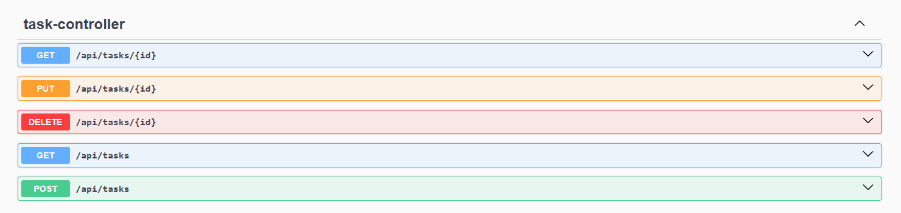

# Task Manager API

> Personal project built as my first backend API using Spring Boot

REST API developed with Spring Boot for task management (full CRUD), applying good backend practices such as data validation, global exception handling, Swagger documentation, and web layer testing.

## Features

- Full task management using CRUD operations
- Request data validation
- Global exception handling
- API documentation with Swagger/OpenAPI
- Web layer testing with MockMvc and JUnit

---

## Technologies used

### Backend
- Java 17
- Spring Boot
- Spring Web
- Spring Data JPA
- Hibernate

### Database
- MySQL

### Tools & utilities
- Lombok
- Swagger (OpenAPI)

### Testing
- JUnit
- MockMvc

---

## Project structure

```
com.IOteiza.taskmanager
│
├── controller
├── service
├── repository
├── entity
├── dto
├── mapper
├── exception
```
---

## API documentation

The API is documented using Swagger/OpenAPI.

You can access the interactive documentation at:

http://localhost:8080/swagger-ui/index.html

### Preview



---

## Tests

Web layer (Controller) tests have been implemented, simulating HTTP requests and validating responses and error handling without needing to start the full application.

Coverage:

✔ Create task  
✔ Validation  
✔ Get all tasks  
✔ Get task by ID  
✔ Update task  
✔ Delete task